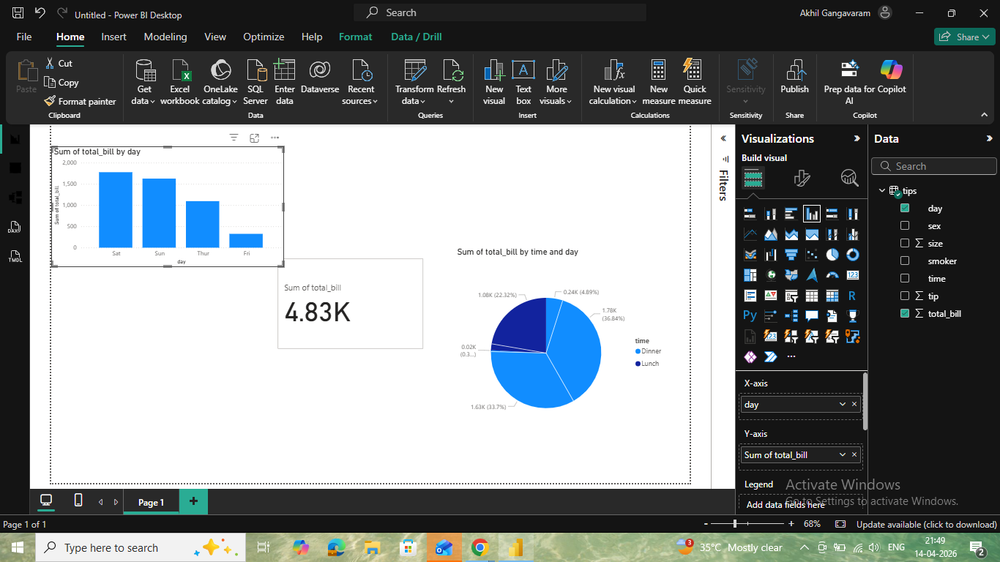

# Sales Dashboard - Power BI

## 📊 Project Overview
This project analyzes sales data using Power BI to identify trends and generate insights.

## 🔍 Key Insights
- Sales trends by day
- Revenue comparison (Lunch vs Dinner)
- Overall performance analysis

## 🛠 Tools Used
- Power BI
- Excel
- SQL

## 📷 Dashboard Preview

## 📁 Files
- project.pbix
- dashboard.png

## 🚀 Conclusion
This dashboard helps in understanding sales patterns and supports better decision-making.
